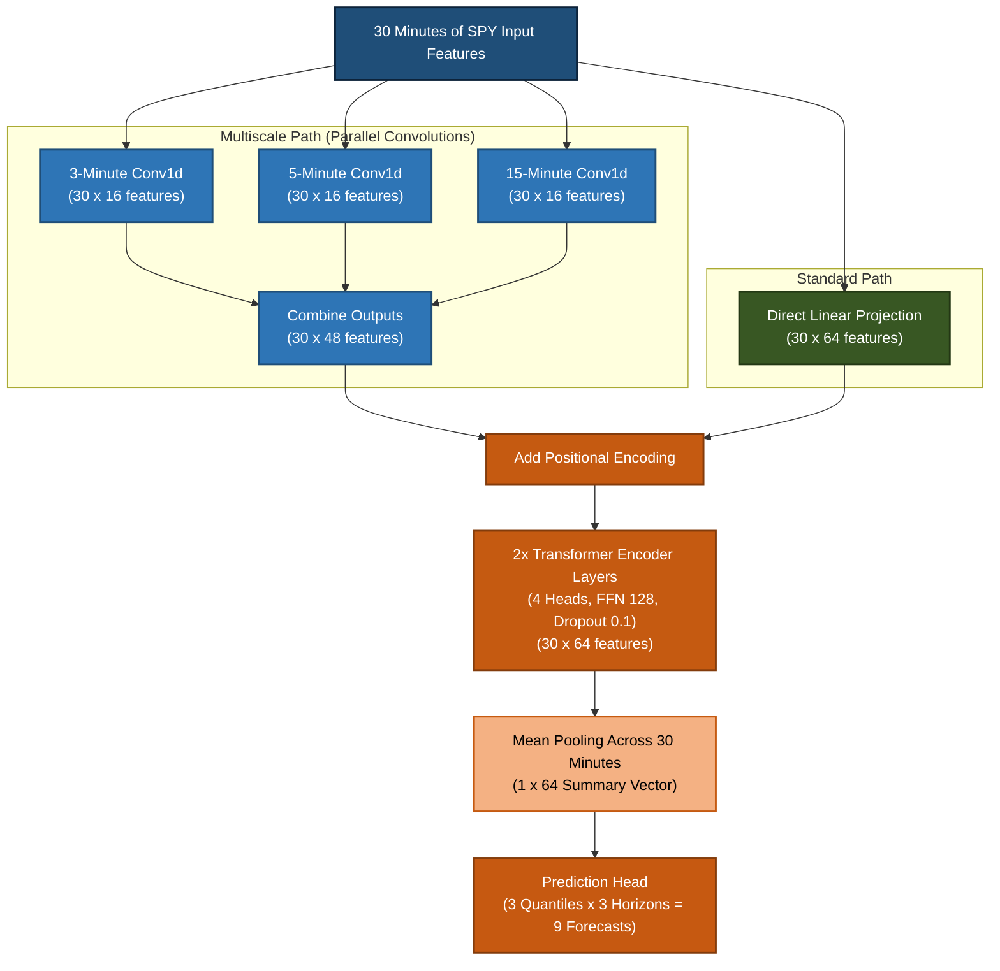

# Project Overview & Methodology Notes

## 1. Layman's Overview
This project investigates whether a small Transformer deep learning model can help a day trader predict SPY (S&P 500 ETF) price movements immediately following the market opening. 

The opening 30 minutes of trading (9:30 AM – 9:59 AM Eastern Time) are known for high volatility. At 10:00 AM, the model analyzes the 30 minute bars from that opening half-hour to forecast return quantiles (10th, 50th/median, and 90th percentiles) at three future time horizons: 10:15 AM (15-min lookahead), 10:30 AM (30-min lookahead), and 11:00 AM (60-min lookahead).

Instead of predicting a single exact price, forecasting quantiles produces an 80% confidence interval, helping quantify potential upside, downside, and uncertainty. The primary research question is whether processing price/volume patterns across multiple time scales (3, 5, and 15 minutes) using parallel convolutions improves forecast accuracy and calibration compared to a standard Transformer or tabular baselines[cite: 1].

---

## 2. Proposed Architecture & Methodology

### Data Pipeline & Features
* **Source:** One-minute SPY data (open, high, low, close, volume) from Alpaca’s historical SIP feed[cite: 1].
* **Splits:**
  * **Training:** January 2016 – December 2024 (sampled every 30 minutes across all regular session hours)[cite: 1].
  * **Validation:** 2025 (only 9:30–9:59 AM morning windows)[cite: 1].
  * **Testing:** January – August 2026 (only 9:30–9:59 AM morning windows)[cite: 1].
* **Input Features:** Minute log returns, candle ranges/bodies relative to price, log volume, relative volume (vs. previous 20 sessions at same minute), 5/15/30-minute momentum, realized volatility, time of day, overnight gap, and current-session range position[cite: 1].

---

### Architecture Comparison
The project compares two PyTorch-based model configurations receiving 30 minutes of input features[cite: 1]:

1. **Multiscale Transformer Branch:**
   * Passes the 30-minute input through three parallel 1D convolutions (kernel sizes matching 3, 5, and 15 minutes)[cite: 1].
   * Each convolution uses stride 1 and padding to retain 30 time steps, producing 16 learned features per minute ($30 \times 16$)[cite: 1].
   * The outputs are concatenated into 48 features per minute ($30 \times 48$) and linearly projected to 64 features ($30 \times 64$)[cite: 1].
2. **Standard Transformer Branch:**
   * Linearly projects the original input features directly to 64 features per minute ($30 \times 64$)[cite: 1].
3. **Shared Encoder & Output Head:**
   * Positional encoding is added[cite: 1].
   * Two `TransformerEncoder` layers with 4 attention heads, 128-unit feed-forward network, and 0.1 dropout[cite: 1].
   * Mean pooling averages the 30 sequence representations into a single 64-feature vector[cite: 1].
   * Dense prediction head outputs 9 values: 3 quantiles (10th, 50th, 90th) $\times$ 3 time horizons (15, 30, 60 minutes)[cite: 1].

---

### Architecture Diagram

